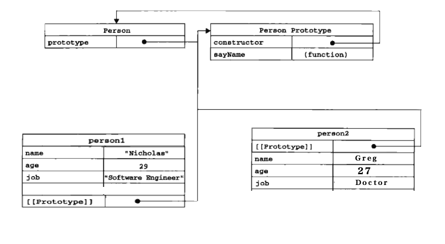

# 对象继承 #
## 1、创建对象
### 1.1 构造函数模式创建对象
    // 构造函数模式创建对象
	function Person(name,age,job){
		this.name = name;
		this.age = age;
		this.job = job;
		this.sayName = function(){
			console.log(this.name);
		}
	}

	var person1 = new Person('Nicholals',"29","softWare");
	var person2 = new Person('Greg',"27","Doctor"); 

**使用new运算符创建对象过程：(如下图)**  

* 创建一个对象
* 将构造函数作用域赋值给新对象(this指向新对象)
* 执行构造函数中的代码(为该对象添加实例实现和方法)
* 返回新对象

** 构造函数模式缺点 **
每个方法都要在实例对象上创建一遍

### 1.2 理解原型模式
每个函数都有prototype属性，改属性指向函数自己的原型对象，原型对象可以让所有对象实例共享属性和方法；

	function Person(name,age,job){
		this.name = name;
		this.age = age;
		this.job = job;
	}
    Person.prototype.sayName = function(){
    	console.log(this.name);
    };
	var person1 = new Person('Nicholals',"29","softWare");
	var person2 = new Person('Greg',"27","Doctor");

** 原型模式缺点(原型属性时引用类型时，会被所有实例共享，) **
 
	function Person(name,age,job){
		this.name = name;
		this.age = age;
		this.job = job;
	}
    Person.prototype.firends = ["mary","lucy"]
    Person.prototype.sayName = function(){
    	console.log(this.name);
    };
	var person1 = new Person('Nicholals',"29","softWare");
	var person2 = new Person('Greg',"27","Doctor");
    
    person1.firends.push("jack");
    // 对person1的修改也会反映到person2
    person2.firends;

## 2、构造函数继承
### 2.1、原型链

### 2.2、 原型链继承(修改子类原型对象)
	function SuperType(){
		this.property = true;
	}

	SuperType.prototype.getSuperValue = function(){
       return this.property;
	};

	function SubType(){
		this.subproperty = false;
	}
    // 思考为什么不用： SubType.prototype = SuperType.protoype;
	// SubType继承SubType,本质上是重写SubType原型对象
	SubType.prototype = new SuperType();

	SubType.prototype.getSubValue = function(){
		return this.subproperty;
	}
	var instance = new SubType();
	console.log(instance.getSuperValue()); // true
    console.log(instance.constructor);  // SuperType

**缺点：** 

* 1、父类中的属性如果是引用类型，子类型继承父类型后，子类型对父类引用类型操作会影响所有子类实例对象
* 2、在创建子类型实例时不能向父类构造函数中传递参数。

demo：

	function SuperType(){
		this.colors = ['red','blue',"green"];
	}
	function SubType(){
		
	}
	// SubType继承SubType,本质上是重写SubType原型对象
	SubType.prototype = new SuperType();

	var instance = new SubType();
	instance.colors.push('black'); 
    console.log(instance.colors);  // red','blue',"green, black"
    
    // 期望：red','blue',"green,
    var instance1 = new SubType();
    console.log(instance1.colors); // red','blue',"green, black"

### 2.3、借用构造函数(拷贝父类的属性添加到子类实例对象中)

    function SuperType(){
		this.colors = ["red","green","blue"];
	}
	function SubType(){
		SuperType.call(this);
	}
	var instance = new SubType();
	instance.colors.push("black");
	console.log(instance.colors); // "red","green","blue","black"

	var instance1 = new SubType();
	console.log(instance1.colors);

**优点： 解决了2.2中的两个问题**
向父类传递参数demo：

	function SuperType(name) {
		this.name = name;
	}
	function SubType(){
		// 继承SuperTYpe,且传递参数
	    Super.call(this,'mapping');
	
	    this.age = 28;
	}
	var instance = new SubType();
	console.log(instance.name);
	console.log(instance.age);

**缺点：**

* 继承父类的方法都定义在构造函数中，无法实现复用；
* 子类不能使用父类原型中的方法(只能继承父类的实例属性)

### 2.4、组合继承(原型链和借用构造函数组合)
使用原型链实现对原型属性和方法的继承，借用构造函数实现对实例属性的继承。既通过在原型上定义方法实现了函数的复用，又能保证每个实例都有它自己的属性；

	function SuperType(name){
		this.name = name;
		this.colors = ['red','green','blue'];
	}
	SuperType.prototype.sayName = function(){
		console.log(this.name);
	};
	function SubType(name,age){
		// 继承属性
		SuperType.call(this,name);
		this.age =age;
	}
	// 继承方法
	SubType.prototype = new SuperType();
	SubType.prototype.constructor = SubType;
	SubType.prototype.sayAge = function(){
		console.log(this.age);
	};

	var instance1 = new SubType("mapping",28);
	instance1.colors.push('black');
	console.log(instance1.colors);  // 'red','green','blue','black'
	instance1.sayName();  // mapping
	instance1.sayAge();  // 28

	var instance2 = new SubType("djh",26);
	console.log(instance2.colors);  // ?
	instance2.sayName();  // djh
	instance2.sayAge();   // 26

**优点：解决2.3缺点**   

**缺点：父类构造函数被调用2次（如下图）**

* 子类构造函数内部执行父类构造函数： SuperType.call(this,name);
* 修改子类原型对象时： SubType.prototype = new SuperType();  

如上图，在subType实例对象和原型对象(SuperType实例对象)中都存在一份name属性和colors属性，说明父类构造函数被执行了2次；

### 2.5、寄生组合式继承
通过借用构造函数类继承构造函数属性，而继承原型方法时不必调用超类型构造函数(new SuperType（）)，而是父类原型对象副本

	function object(o){
		function F(){}
	    F.prototype = o;
		return new F();
	}
	function inheritPrototype(subType,superType){
		var prototype = object(superType.prototype);
		prototype.constructor = subType;
		subType.prototype = prototype;
	}
	function SuperType(name){
		this.name = name;
		this.colors = ['red','blue','green'];
	}
	SuperType.prototype.sayName = function(){
		console.log(this.name);
	}
	function SubType(name,age){
		SuperType.call(this,name);
		this.age = age;
	}
	// 继承父类原型
	inheritPrototype(SubType,SuperType);
	SubType.prototype.sayAge = function(){
		console.log(this.age);
	}
	var instance = new SubType("mapping","24");
	instance.sayName();
	instance.sayAge();
    
 **优点：**
只调用一次SuperType(父类构造函数)，避免了SubType原型上创建多余不必要的属性。 
 
## 3、非构造函数继承
### 3.1、原型式继承
根据已有的对象A创建一个新对象B，对象B继承A；

	function object(o){
		function F(){}
	    F.prototype = o;
		return new F();
	    
	}

    var person = {
    	name: 'mapping',
        firends: ['personA',"personB","PersonC"]
    }
    
    var person1 = object(person);
    console.log(person1.name);
    person1.firends.push("personD");

    // 效果同ECMAScript5 Object.create()
    var person2 = Object.create(person);

### 3.2、修改单个对象原型

	Object.setPrototypeOf(子对象，父对象);  
    
    var parent = {car:"BMW",money: 1000000,intr:function(){}};
    function Student(){
    	this.name = name;
    }
    var hmm = new Student("hmm");
    var lilei = new Student("lilei");
    // 修改单个对象原型
    Object.setPrototypeOf(hmm,parent); 
    console.log(hmm.car);   // BMW
    console.log(lilei.car); // undefined 

### 3.3、es6 extends关键字实现继承

   	class Point {
	  constructor(x, y) {
	    this.x = x;
	    this.y = y;
	  }
	
	  toString() {
	    return '(' + this.x + ', ' + this.y + ')';
	  }
	
	}

	class ColorPoint extends Point {
	  constructor(x, y, color) {
	    super(x, y); // 调用父类的constructor(x, y)
	    this.color = color;
	  }
	
	  toString() {
	    return this.color + ' ' + super.toString(); // 调用父类的toString()
	  }
	}

    let p = new ColorPoint(2,3,"red");
	console.log(p.toString());  // red (2,3)

## 4、面向对象API

### 4.1、检查两对象见继承关系: 父对象.isPrototypeOf(子对象)

	例：1.1中：
	Person.prototype.isPrototypeOf(person1)  // true

### 4.2、获得对象原型

1、构造函数名.prototype  
2、获得任意对象原型： Object.getPrototypeOf(obj)

	例：3.2  
    Object.getPrototypeOf(hmm)   // parent {} 
    Object.getPrototypeOf(lilei) // Student.prototype

### 4.3、属性检测

	function Person(name,age,job){
		this.name = name;
		this.age = age;
	}
	Person.prototype.className="高三一班";
	var person1 = new Person('Nicholals',"29");
	var person2 = new Person('Greg',"27");

#### 4.3.1 检查整个原型关系上是否存在某个属性（in）,但是无法区分是原型属性还是实例属性

	console.log('className' in person1);   // 原型对象中存在className
	console.log('age' in person1);         // person1中存在age

#### 4.3.2 检查实例属性(hasOwnProperty（）)

    console.log(person1.hasOwnProperty("age"));       // true
	console.log(person1.hasOwnProperty("className")); // false, className是原型属性
    
#### 4.3.2 检查原型属性

	//属性在原型链中，并且不是自有的属性；
	if((“属性名” in 对象)&&！（obj.hasOwnProperty(“属性名”)）){
	           console.log(“原型属性”);
	}
    
    if(('className' in person1) && !person1.hasOwnProperty("className")){
		console.log("className是原型属性");
    }